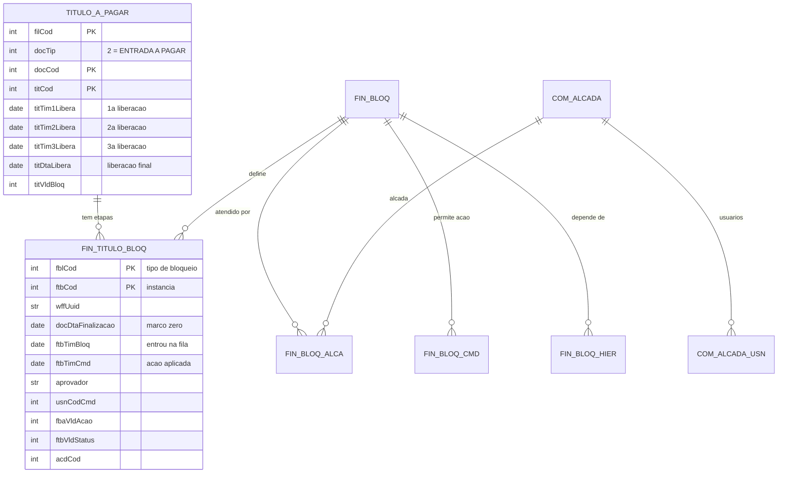

# Frente V — Spike: onde vive o workflow de aprovação no Conexos

> **Método:** análise estática dos specs OpenAPI em `docs/conexos-api/*.json` + leitura do código
> de integração em `src/backend/domain/client/`. **Nenhuma chamada à API real foi feita.**
> **Data:** 2026-08-18.
> Marcação: **[FATO]** = lido diretamente no spec/código · **[HIPÓTESE]** = inferência a validar
> contra o ERP de homologação ou com o analista da Columbia.

---

> ## ⚠ CORRIGIDO PELO PROBE EM PRODUÇÃO (2026-08-18)
>
> Este documento é **análise estática dos specs**. Produção corrigiu várias conclusões dele.
> Leia `frente-v-probe-resultado.md` **antes** de agir sobre qualquer coisa daqui.
>
> - ❌ **O §1.1 abaixo está errado.** A "escada de 3 liberações" **não é a trilha**: em produção
>   `titVld1/2/3Libera = 1` em 100% dos títulos, com **zero** timestamps e **zero** nomes.
>   `titVldNLibera = 1` **não** significa "o nível N aprovou".
> - ✅ **O workflow real é o mecanismo do §1.2** (bloqueio, `FinTituloBloq`) — e é rico: **11 etapas
>   distintas** (CONTROLLER, TI, FISCAL, DIRETORIA II, …), duas ações (`LIBERAR`, `APROVAR`) e
>   **14 aprovadores** identificados só na filial 2.
> - ✅ **Os timestamps preservam a hora** e a trilha é **histórica**: doc 4156/1 (filial 1) devolve
>   `CONTROLLER · COMPRAS · LIBERAR · DANILO_LARA`, recebido em 2026-05-14 07:12:46 e liberado em
>   2026-05-15 06:41:40.
> - ❌ **O universo NÃO é `fin026/list`** (E1 do §3.1) — essa é a carteira **corrente** e perde os
>   títulos antigos. O universo certo é **`psq014/list`** (tela de pesquisa).
> - ⚠ **`fin103/list` (E2 do §3.1) devolve vazio**: o usuário de API não tem acesso à tela. O que
>   funciona hoje é `fin026/infoTitulo/list` (ou `com308/financeiroAPagar/infoTitulo/list`),
>   **um título por chamada**.

## 0. Resumo em cinco linhas

1. **[FATO]** Não existe um módulo "workflow" no Conexos. A aprovação de títulos é implementada por
   **dois mecanismos complementares**: uma **escada fixa de 3 liberações gravada no próprio título**
   e uma **fila de bloqueios por alçada** (`FinTituloBloq`).
2. **[FATO]** A escada de liberações é **durável e histórica**: `titVld1/2/3Libera` (aprovou sim/não),
   `titTim1/2/3Libera` (quando), `usnDesNome1/2/3Lib` (quem), com observação e cancelamento por nível.
3. **[FATO]** `POST /api/fin026/list` devolve essa escada **em massa, paginada e filtrável** — é
   praticamente a linha do grid da Frente V pronta.
4. **[FATO]** `POST /api/fin103/list` devolve `FinTituloBloq` **em massa** — a fila de aprovação, com
   `docDtaFinalizacao` (marco zero), `ftbTimBloq` (quando a etapa entrou na fila), `aprovador`, `acdCod`.
5. **Consequência:** o maior risco imaginado (varredura título-a-título) **não existe**. Duas chamadas
   paginadas por filial cobrem o painel inteiro.

---

## 1. Os dois mecanismos

### 1.1 Escada de liberações (no título)

**[FATO]** O DTO `InfoFinTituloDTO` (`docs/conexos-api/090-fin0.json`) e a linha de listagem
`FinTituloFin026` carregam três níveis fixos de liberação, cada um com estado, ator e timestamp:

| Nível | Aprovou? | Quando | Quem (cód) | Quem (nome) | Observação | Cancelamento |
|-------|----------|--------|------------|-------------|------------|--------------|
| 1º | `titVld1libera` (1=SIM, 2=NÃO) | `titTim1libera` | `titUsn1libera` | `usnDesNome1lib` | `titLng1obslibera` | `titUsn1clib` / `titTim1clib` |
| 2º | `titVld2libera` | `titTim2libera` | `titUsn2libera` | `usnDesNome2lib` | `titLng2obslibera` | `titUsn2clib` / `titTim2clib` |
| 3º | `titVld3libera` | `titTim3libera` | `titUsn3libera` | `usnDesNome3lib` | `titLng3obslibera` | `titUsn3clib` / `titTim3clib` |

Complementos no mesmo DTO: `titDtaLibera` (liberação final), `titLiberaApto`, `titVldBloq`
(0=NÃO/1=SIM), `titVldStatus` (1=ATIVO/2=RENEGOCIADO/3=CANCELADO), `titEspMotivo`.

> **[FATO] `docTip` discrimina o universo:** `1 = SAÍDA A RECEBER`, `2 = ENTRADA A PAGAR`.
> Como a Fase 1 é **Contas a Pagar**, todo filtro leva `docTip#EQ: 2`.

> **[HIPÓTESE] Nomenclatura dos campos varia entre schemas.** `FinTituloFin026` usa
> `titTim1Libera` / `titVld1Libera` (L maiúsculo); `InfoFinTituloDTO` e `FinTituloFin` usam
> `titTim1libera` / `titVld1libera` (l minúsculo). Isso é comum no Conexos e o projeto já convive com
> isso, mas **precisa ser confirmado contra a resposta real** antes de escrever o parser — errar a
> caixa da letra devolve `undefined` silencioso. Tratar com Zod tolerante a ambas as grafias.

### 1.2 Fila de bloqueios por alçada

**[FATO]** `FinTituloBloq` (definido em `090-fin0.json`, `100-fin1.json`, `070-com3.json`,
`190-psq0.json`) é a **instância** de uma etapa de aprovação sobre um título.

Chave natural: `filCod` + `docTip` + `docCod` + `titCod` + `fblCod` + `ftbCod`.

| Campo | Papel na Frente V |
|-------|-------------------|
| `wffUuid` | correlaciona etapas de uma mesma execução de workflow |
| `docDtaFinalizacao` | **marco zero do relógio** — "documento finalizado às 10:00 de 18/08" |
| `ftbTimBloq` | criação do bloqueio — **"fulano recebeu o WF às 18:09"** |
| `ftbTimCmd` | hora de aplicação do comando — **"aprovou às 10:00 do dia 19/08"** |
| `aprovador` | nome do aprovador designado |
| `usnCodCmd` / `usnDesNomeCmd` | quem efetivamente aplicou o comando |
| `fbaVldAcao` | ação do comando (liberar / cancelar / encaminhar) |
| `fbaVldRespProcesso` | 0=ALÇADA, 1=ÚNICO, 2=MESMO GESTOR, 3=OUTRO GESTOR |
| `ftbVldStatus` | situação do bloqueio |
| `acdCod`, `alcadaUsuario`, `limitaAlcada` | alçada exigida vs. alçada do usuário |
| `fblCodEnc` / `fblDesNomeEnc` | bloqueio de encaminhamento (próxima etapa) |
| `motCodCanc` / `motDesNomeCanc` | motivo de cancelamento |
| `ftbEspInfo` / `ftbEspObsCmd` | observação do bloqueio / do comando |
| `titDtaLibera`, `titVldBloq`, `possuiDependencia` | status agregado do título |
| `pesCodProc` / `dpeNomPessoaProc` | **cliente do processo** — dimensão da Fase 2 |
| `pesCodLig` / `dpeNomPessoaLig` | **encomendante/adquirente** — dimensão da Fase 2 |
| `pesCod` / `pesCodPort` | portador |

**[FATO]** Os enums numéricos (`fbaVldAcao`, `ftbVldStatus`) **não têm legenda no spec**. Diferente de
`docTip`, `titVldStatus` e `titVldBloq`, que trazem `<ul><li>` com os valores. Isso é uma lacuna real:
**precisamos descobrir os códigos por observação em homologação**. É a pergunta P0 nº 1.

### 1.3 Configuração (não é instância)

**[FATO]** Estes schemas descrevem *como* o workflow é configurado, não o que aconteceu num título:

| Schema | O que é | Endpoint |
|--------|---------|----------|
| `FinBloq` | definição de um tipo de bloqueio (nome, e-mails, status) | `fin102` |
| `FinBloqAlca` | quais alçadas atendem um bloqueio (`fblCod`+`acdCod`+`acbCod`) | `fin106/finBloqAlca` |
| `FinBloqCmd` | comandos/ações configurados por bloqueio (`fblCod`+`fbaCod`) | `fin106/finBloqCmd` |
| `FinBloqHier` | dependência entre bloqueios (`fblCod`+`fblCodDep`) | `fin102/bloqHier` |
| `FinBloqRegras` / `FinDocRegraBloq` | regras que disparam o bloqueio | `fin102/bloqRegras` |
| `FinBloqEmail` / `ViewFinBloqEnvioEmail` | notificação por e-mail do WF | `fin102/FinBloqEmail` |
| `ComAlcada` / `ComAlcadaUsn` | cadastro de alçadas e usuários por alçada | `com1` / `wrk0` |

Ler `FinBloq` (nome do bloqueio) e `FinBloqAlca` (alçadas) **uma vez por sincronização** e cachear é
suficiente — são dados de cadastro, mudam raramente. Isso evita repetir o nome do bloqueio em cada
linha da varredura.

---

## 2. Mapa ER



---

## 3. Endpoints — o que usar

### 3.1 Leitura em massa (base da ingestão) — **[FATO]**

| # | Endpoint | Método | Resposta | Papel |
|---|----------|--------|----------|-------|
| E1 | `/api/fin026/list` | POST | `CnxListResponseFinTituloFin026` | **grid da Frente V**: título + escada de 3 liberações |
| E2 | `/api/fin103/list` | POST | `CnxListResponseFinTituloBloq` | **fila de aprovação**: bloqueios, alçadas, `docDtaFinalizacao`, `ftbTimBloq` |
| E3 | `/api/psq014/list` | POST | `CnxListResponseDocsPagarReceberDTO` | alternativa ampla (78 campos, a pagar **e** a receber) |

O join entre E1 e E2 é por `filCod` + `docTip` + `docCod` + `titCod`.

**[FATO]** Todos usam o envelope padrão `CnxListRequest`:

```jsonc
{
  "fieldList":  ["filCod", "docCod", "titCod", "..."],   // campos desejados
  "filterList": { "docTip#EQ": 2, "filCod#EQ": 2 },      // operadores: #EQ, #IN, ...
  "pageNumber": 1,
  "pageSize":   500,
  "serviceName": "fin026"
}
```

e respondem `{ count, pageNumber, summary, rows[] }`.

> **[HIPÓTESE] Operadores de filtro além de `#EQ` e `#IN`.** O spec só exemplifica esses dois
> (`"{ field1#EQ: 1, field2#IN: [1, 2] }"`) e o código do projeto só usa esses dois
> (`ConexosCadastroClient.ts:168`, `ConexosTitulosClient.ts:236`). **Não há evidência de operador de
> intervalo de data** (`#GE`/`#BETWEEN`). Se não existir, a janela temporal da ingestão precisa ser
> feita por paginação + corte no nosso lado, não por filtro no ERP. **Validar em homologação** — isso
> dimensiona o custo do job.

> **[HIPÓTESE] `serviceName`.** O projeto usa a forma pontuada em alguns casos
> (`serviceName: 'com308.finTituloFin'`, `ConexosTitulosClient.ts:237`) e a simples em outros
> (`serviceName: 'imp021'`, `ConexosCadastroClient.ts:169`). O valor correto para `fin026`/`fin103`
> precisa ser observado no tráfego real da tela.

### 3.2 Detalhe por título — **[FATO]**

| # | Endpoint | Método | Resposta | Papel |
|---|----------|--------|----------|-------|
| E4 | `/api/fin026/infoTitulo/{filCod}/{docTip}/{docCod}/{titCod}` | GET | `InfoFinTituloDTO` | escada de liberações completa, com observações e cancelamentos |
| E5 | `/api/fin026/infoTitulo/list/{filCod}/{docTip}/{docCod}/{titCod}` | POST | `CnxListResponseFinTituloBloq` | todas as etapas de bloqueio do título |
| E6 | `/api/fin103/{filCod}/{docTip}/{docCod}/{titCod}/{fblCod}/{ftbCod}` | GET | `FinTituloBloq` | uma etapa específica |
| E7 | `/api/psq014/infoTitulo/list/{filCod}/{docTip}/{docCod}/{titCod}` | POST | `CnxListResponseFinTituloBloq` | equivalente ao E5, pela tela de pesquisa |
| E8 | `/api/com308/financeiroAPagar/infoTitulo/list/{docCod}/{titCod}` | POST | `CnxListResponseFinTituloBloq` | equivalente, pela tela de contas a pagar |

**A tela de detalhe (timeline) usa E4 + E5.** Juntos entregam os dois mecanismos do §1.

### 3.3 Endpoints de log — **[HIPÓTESE], alta prioridade de validação**

| Endpoint | Método | Resposta no spec |
|----------|--------|------------------|
| `/api/fin026/log/{docTip}/{docCod}/{titCod}` | GET | **não tipada** (`{}`) |
| `/api/psq014/log/{filCod}/{docTip}/{docCod}` | GET | **não tipada** (`{}`) |
| `/api/com308/financeiroAPagar/log/{docCod}/{titCod}` | GET | **não tipada** (`{}`) |
| `/api/fin106/finBloqCmd/log/{fblCod}/{fbaCod}` | GET | **não tipada** (`{}`) |
| `/api/fin106/finBloqAlca/log/{acdCod}/{fblCod}/{acbCod}` | GET | **não tipada** (`{}`) |

**[FATO]** O spec não descreve o corpo da resposta desses endpoints. **[HIPÓTESE]** São a auditoria
de alterações do Conexos (padrão "log de tela") e podem conter a trilha completa de mudanças de campo
com usuário e data — o que seria a fonte ideal e dispensaria boa parte do nosso diffing de snapshots.

> **Esta é a incógnita de maior valor do projeto.** Uma única chamada em homologação a
> `GET /api/fin026/log/2/{docCod}/{titCod}` sobre um título que já passou por aprovação resolve.
> Recomendo um **probe dedicado** (§6) antes de fechar o desenho de persistência.

### 3.4 Escrita — documentado, **não usar na Fase 1** — **[FATO]**

`PUT /api/com308|com309|com310|com311/.../infoTitulo/trocaBloqueio` (troca de bloqueio),
`POST /api/com308/infoTitulo/regerarBloqueios` (**regera a trilha**), `POST /api/fin103/aplicarComando`
(aplica o comando de aprovação), `POST /api/fin103/bloqueioManual` e `.../cancela`,
`POST /api/fin063/aprovarDesconto`.

> `regerarBloqueios` é o inimigo da nossa trilha derivada: ele reescreve as etapas de um título.
> Precisa de regra de negócio explícita (evento `WORKFLOW_REGERADO`) — ver §5, R3.

---

## 4. Como o projeto já fala com o Conexos — **[FATO]**

A integração é madura e a Frente V não inventa nada:

- `src/backend/domain/client/ConexosBaseClient.ts:1` — `@injectable() @singleton()`, injeta
  `RetryExecutor`, expõe `paginate` com `PAGE_SIZE = 500` (`:104`) e `MAX_PAGES = 50` (`:113`),
  `CHUNK_SIZE = 50` (`:96`) para fan-out de filtros `#IN`.
- `src/backend/domain/client/legacyConexosAdapter.ts:21` — `buildLegacyConexosAdapter` transforma
  `serviceName` em `POST /{serviceName}` e desembrulha `.rows`; `listGenericPaginated` (`:37`)
  preserva o envelope `{count, rows}`.
- `ConexosBaseClient.ts:9` — `BR_NOON_SHIFT_MS`: **timestamps do Conexos vêm como meia-noite UTC do
  dia BR** e o projeto desloca +15h para preservar o dia. **Atenção crítica para a Frente V:** se
  esse tratamento valer para `ftbTimBloq`/`titTim1Libera`, perdemos a **hora** e só temos a data —
  o que quebraria o caso canônico do cliente ("às 18:09"). **Validar campo a campo em homologação.**
  Ver pergunta P0 nº 2.
- Sub-clients por domínio, um por família: `ConexosTitulosClient.ts:213` (`listTitulosAPagar`, usa
  `serviceName: 'com308.finTituloFin'` e `filterList: { 'titVldStatus#EQ': '1' }`),
  `ConexosSispagClient`, `ConexosExtratoClient`, `ConexosNdeClient`, etc.
- Sessão resolvida por chamada (`ConexosSessionResolver.ts`) — usuário logado ou robô (ADR-0007).

**Padrão a seguir na Frente V:** criar `ConexosAprovacoesClient` (`@injectable() @singleton()`),
estendendo/compondo `ConexosBaseClient`, com métodos `listTitulosComLiberacoes` (E1),
`listBloqueiosTitulo` (E2), `getTrilhaTitulo` (E4+E5) e `listCadastroBloqueios` (`FinBloq`+`FinBloqAlca`, cacheado).

---

## 5. Cobertura do caso canônico do cliente

> "O documento 123 foi finalizado às 10:00 de 18/08; o Fulano recebeu o WF às 18:09 desse dia e
> aprovou às 10:00 do dia 19/08."

| Elemento pedido | Campo | Endpoint | Confiança |
|-----------------|-------|----------|-----------|
| documento 123 | `docEspNumero` / `docCod` | E1 | **[FATO]** |
| "finalizado às 10:00 de 18/08" | `docDtaFinalizacao` | E2 | **[FATO]** que o campo existe; **[HIPÓTESE]** que preserva a hora |
| "Fulano" | `aprovador` / `usnDesNome1Lib` | E2 / E1 | **[FATO]** |
| "recebeu o WF às 18:09" | `ftbTimBloq` | E2 | **[HIPÓTESE]** que `ftbTimBloq` = momento da atribuição ao aprovador |
| "aprovou às 10:00 do dia 19/08" | `ftbTimCmd` / `titTim1Libera` | E2 / E1 | **[FATO]** |
| "quantas aprovações faltam" | `titVld1/2/3Libera` + bloqueios ativos | E1 + E2 | **[FATO]** |
| "quanto tempo cada um levou" | derivado: `ftbTimCmd − ftbTimBloq` | — | derivável se a hora sobreviver |

**Veredito:** o caso canônico é atendível, **condicionado a duas validações em homologação** — a
preservação da hora nos timestamps e a semântica de `ftbTimBloq`. Ambas são baratas de checar.

---

## 6. Probe recomendado antes de codar

Seguindo o padrão já existente em `src/backend/jobs/probe-*.ts`, um script
`probe-aprovacoes-fin026.ts` que, contra homologação e **somente leitura**:

1. `POST fin026/list` com `docTip#EQ: 2`, `pageSize: 5` → confirma `serviceName`, grafia dos campos
   de liberação e se a **hora** sobrevive em `titTim1Libera`.
2. `POST fin103/list` com `docTip#EQ: 2` → confirma acesso, e coleta a distribuição de valores de
   `fbaVldAcao` e `ftbVldStatus` (para descobrir os enums).
3. `GET fin026/infoTitulo/{filCod}/2/{docCod}/{titCod}` num título já aprovado → confirma a escada
   completa com observações.
4. `GET fin026/log/2/{docCod}/{titCod}` → **descobre o formato do log** (a incógnita de maior valor).
5. Testa se `filterList` aceita operador de intervalo de data.

O resultado desse probe fecha as perguntas P0 e trava o desenho de persistência.

---

## 7. Perguntas P0 (bloqueiam o desenho)

1. **Quais são os códigos de `fbaVldAcao` e `ftbVldStatus`?** Sem a legenda não sabemos distinguir
   "aprovou" de "cancelou" de "encaminhou". → resolver pelo probe (§6.2) + confirmação do analista.
2. **Os timestamps preservam a hora?** `ConexosBaseClient.ts:9` documenta que datas do Conexos chegam
   como meia-noite UTC. Se `ftbTimBloq`/`titTim1Libera` forem assim, o pedido "às 18:09" é impossível
   e o escopo muda para granularidade de dia. → probe (§6.1).
3. **`ftbTimBloq` é mesmo "quando o aprovador recebeu"?** Ou é "quando o bloqueio foi criado pela
   regra", que pode preceder a atribuição a uma pessoa? → analista da Columbia.
4. **A Columbia usa alçadas (`acdCod`) de fato, ou só a escada de 3 liberações?** Determina se
   modelamos `Alcada` como entidade ou ignoramos. → analista.
5. **Aprovação por e-mail conta como etapa?** Existe `FinBloqEmail` / `fblVldEmailDaprovar`. Se o
   aprovador responde por e-mail, o timestamp registrado é o do e-mail ou o do processamento? → analista.
6. **`regerarBloqueios` é usado na operação?** Com que frequência? Determina o peso da regra de
   trilha regerada. → analista.

## 8. Perguntas P1 (não bloqueiam)

7. Quantos títulos a pagar ativos existem por filial? (dimensiona o job — ver `MAX_PAGES = 50` × 500 = 25k linhas por combinação de filtro).
8. Quantas filiais entram no escopo?
9. Há títulos que nascem já liberados (sem passar por WF)? Como distingui-los de "sem workflow"?
10. O `wffUuid` é populado na prática ou vem vazio?

---

## 9. Estado da documentação interna

**[FATO]** `docs/conexos-api/screens/` documenta hoje: `cmn023`, `cmn025`, `cmn156`, `com006`,
`com014`, `com015`, `com016`, `com017`, `com034`. **Nenhuma tela de aprovação/bloqueio está
documentada** — faltam `fin026`, `fin102`, `fin103`, `fin106`, `com308`, `psq014`.

Sugestão: a Frente V produz, como subproduto, `docs/conexos-api/screens/fin026.md` e `fin103.md` no
template existente (`docs/conexos-api/screens/_TEMPLATE.md`), alimentados pelo probe do §6.
